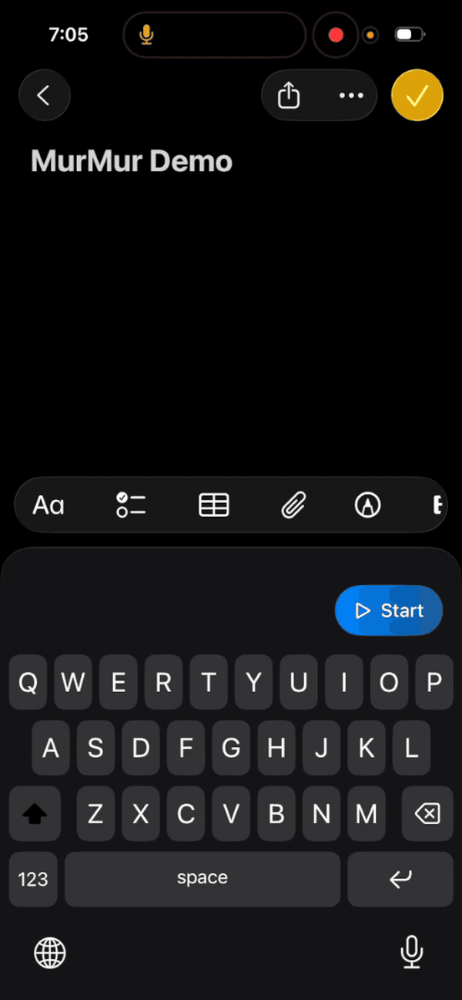
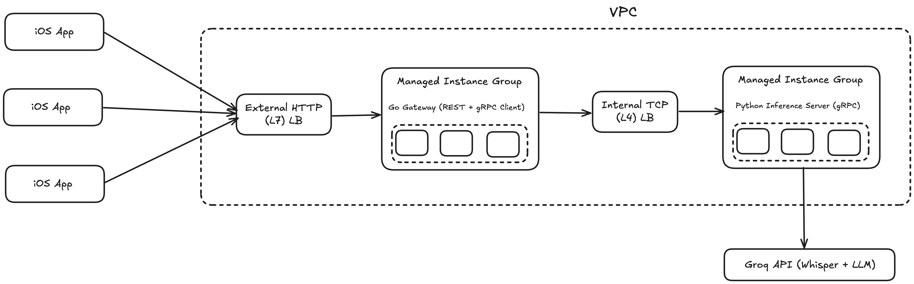

  

  <h3 align="center">MurMur — AI Voice‑to‑Text Keyboard</h3>

  

    MurMur is an iOS app that turns speech into text with correct grammar, spelling and punctuations across any iOS app via a custom keyboard.
     
     
    <a href="https://drive.google.com/file/d/11eIUGKpVzjHL2zX_bEugypqO4KNLHB0i/view?usp=sharing" style="margin-top:20px">View Demo</a>
     
     
    
  

---

### 🏗️ System Architecture

---

### 📦 Repositories

| Component                  | Repository                                                                      | Description                                                                                            |
| -------------------------- | ------------------------------------------------------------------------------- | ------------------------------------------------------------------------------------------------------ |
| iOS app + keyboard (Swift) | [murmur-ios](https://github.com/NirajNair/murmur-ios)                           | Swift app with KeyboardKit‑based keyboard extension; sends audio to REST and inserts text system‑wide. |
| REST gateway (Go)          | [murmur-server](https://github.com/NirajNair/murmur-server)                     | Serves HTTP API that streams audio via gRPC to inference server and returns transcription in JSON.     |
| Inference service (Python) | [murmur-inference-server](https://github.com/NirajNair/murmur-inference-server) | gRPC server for transcription (Groq API/Faster‑Whisper) and LLM cleanup (Groq API/llama.cpp).          |

---

### 🧰 Tech Stack

- **Client (iOS)** - Swift, KeyboardKit SDK
- **Gateway (Backend)** - Go, Fiber, gRPC
- **Inference**
  - Python, gRPC
  - Groq APIs for Whisper transcription and LLM post-processing.
  - Local Whisper and LLM fallback - Faster‑Whisper (batched inference, VAD) & `llama.cpp` via `llama-cpp-python`
- **Infrastructure**
  - Docker, Docker Compose
  - GCP (Managed Instance Groups, LB, Artifact Registry, Secret Manager, DNS)
  - Firebase (Remote Config)
  - Env‑driven configuration

---

### 🏅 Key Highlights

- **Streaming pipeline end‑to‑end**: Client‑streamed audio over gRPC with chunked forwarding from the Go gateway; VAD‑aware transcription to reduce latency and cost.
- **LLM‑assisted cleanup**: Transcription post‑processing via LLM using Groq with automatic fallback to local LLM model.
- **CPU‑friendly deployment**: Works on CPU‑only hosts with quantized models and configurable threads/batch sizes.
- **Resilience and observability**: gRPC health checks, model warm‑up, pool management, and fallbacks for robust production behavior.
- **Seamless iOS UX**: KeyboardKit integration enables dictation into any app, with background notification bridges and simple, predictable API usage.
